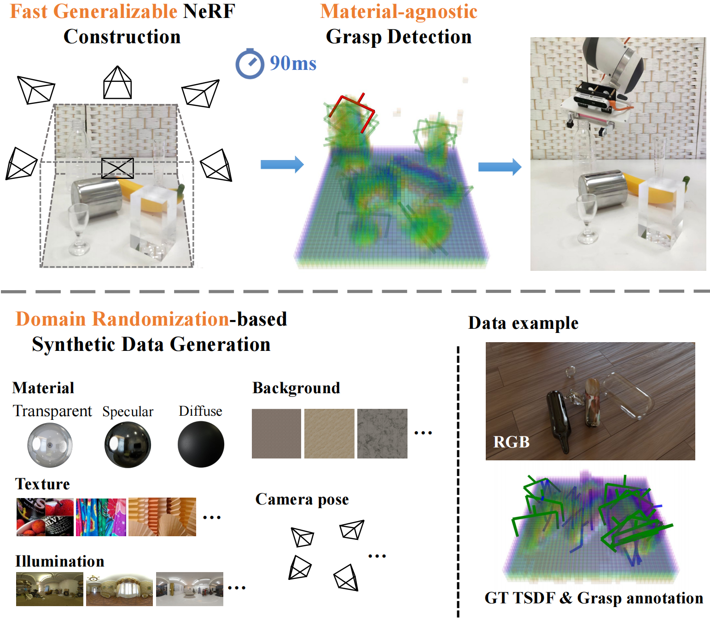

# GraspNeRF: Multiview-based 6-DoF Grasp Detection for Transparent and Specular Objects Using Generalizable NeRF (ICRA 2023)

This is the official repository of [**GraspNeRF: Multiview-based 6-DoF Grasp Detection for Transparent and Specular Objects Using Generalizable NeRF**](https://arxiv.org/abs/2210.06575).

For more information, please visit our [**project page**](https://pku-epic.github.io/GraspNeRF/).

## Introduction


In this work, we propose a multiview RGB-based 6-DoF grasp detection network, **GraspNeRF**, 
that leverages the **generalizable neural radiance field (NeRF)** to achieve material-agnostic object grasping in clutter. 
Compared to the existing NeRF-based 3-DoF grasp detection methods that rely on densely captured input images and time-consuming per-scene optimization, 
our system can perform zero-shot NeRF construction with **sparse RGB inputs** and reliably detect **6-DoF grasps**, both in **real-time**. 
The proposed framework jointly learns generalizable NeRF and grasp detection in an **end-to-end** manner, optimizing the scene representation construction for the grasping. 
For training data, we generate a large-scale photorealistic **domain-randomized synthetic dataset** of grasping in cluttered tabletop scenes that enables direct transfer to the real world. 
Experiments in synthetic and real-world environments demonstrate that our method significantly outperforms all the baselines in all the experiments.

## Overview
This repository provides:
- PyTorch code, and weights of GraspNeRF.
- Grasp Simulator based on blender and pybullet.
- Multiview 6-DoF Grasping Dataset Generator and Examples.

## Dependency
1. Please run 
```
pip install -r requirements.txt
```
to install dependency.

2. (optional) Please install [blender 2.93.3--Ubuntu](https://www.blender.org/) if you need simulation.

## Data & Checkpoints
1. Please generate or download and uncompress the [example data](https://drive.google.com/file/d/1Ku-EotayUhfv5DtXAvFitGzzdMF84Ve2/view?usp=share_link) to `data/` for training, and [rendering assets](https://drive.google.com/file/d/1Udvi2QQ6AtYDLUWY0oH-PO2R6kZBxJLT/view?usp=share_link) to `data/assets` for simulation. 
Specifically, download [imagenet valset](https://image-net.org/data/ILSVRC/2010/ILSVRC2010_images_val.tar) to `data/assets/imagenet/images/val` which is used as random texture in simulation. 
2. We provide pretrained weights for testing. Please download the [checkpoint](https://drive.google.com/file/d/1k-Cy4NO2isCBYc3az-34HEdcNxDptDgU/view?usp=share_link) to `src/nr/ckpt/test`. 

## Testing
Our grasp simulation pipeline is depend on blender and pybullet. Please verify the installation before running simulation.

After the dependency and assets are ready, please run 
```
bash run_simgrasp.sh
```

## Training
After the training data is ready, please run
```
bash train.sh GPU_ID
```
e.g. `bash train.sh 0`.

## Data Generator
1. Download the scene descriptor files from [GIGA](https://github.com/UT-Austin-RPL/GIGA#pre-generated-data) and [assets](https://drive.google.com/file/d/1-59zcQ8h5esT_ogjaDjtzQ6sG70WNWzU/view?usp=share_link).
2. For example, run 
```
bash run_pile_rand.sh 
```
in ./data_generator for pile data generation.

## Citation
If you find our work useful in your research, please consider citing:

```
@article{Dai2023GraspNeRF,
  title={GraspNeRF: Multiview-based 6-DoF Grasp Detection for Transparent and Specular Objects Using Generalizable NeRF},
  author={Qiyu Dai and Yan Zhu and Yiran Geng and Ciyu Ruan and Jiazhao Zhang and He Wang},
  booktitle={IEEE International Conference on Robotics and Automation (ICRA)},
  year={2023}
```

## License

 This work and the dataset are licensed under [CC BY-NC 4.0][cc-by-nc].

 [![CC BY-NC 4.0][cc-by-nc-image]][cc-by-nc]

 [cc-by-nc]: https://creativecommons.org/licenses/by-nc/4.0/
 [cc-by-nc-image]: https://licensebuttons.net/l/by-nc/4.0/88x31.png

## Contact
If you have any questions, please open a github issue or contact us:

Qiyu Dai: qiyudai@pku.edu.cn, Yan Zhu: zhuyan_@stu.pku.edu.cn, He Wang: hewang@pku.edu.cn
